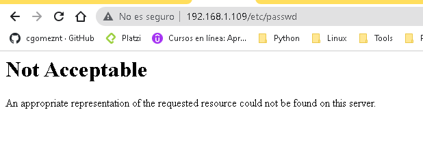

Apache httpd : Configurando mod_security
=========================================

Debe tener instalado httpd, instalamos el mod_security::

	# dnf -y install mod_security
	
Editamos el archivo de configuracion y cambiamos la forma en que trabaja mod_security, que son las siguientes:

    SecRuleEngine On	(Encendido)
	
    SecRuleEngine Off	(Apagado)
    
	SecRuleEngine DetectionOnly	(Actvo, pero sin bloquear)
	
Lo editamos::

	# vi /etc/httpd/conf.d/mod_security.conf

	<IfModule mod_security2.c>
		# Default recommended configuration
		SecRuleEngine On
		#SecRuleEngine Off
		#SecRuleEngine DetectionOnly
		SecRequestBodyAccess On
		SecRule REQUEST_HEADERS:Content-Type "text/xml" \
			 "id:'200000',phase:1,t:none,t:lowercase,pass,nolog,ctl:requestBodyProcessor=XML"
		SecRequestBodyLimit 13107200
		SecRequestBodyNoFilesLimit 131072
		SecRequestBodyInMemoryLimit 131072
		SecRequestBodyLimitAction Reject
		SecRule REQBODY_ERROR "!@eq 0" \
		"id:'200001', phase:2,t:none,log,deny,status:400,msg:'Failed to parse request body.',logdata:'%{reqbody_error_msg}',severity:2"
		SecRule MULTIPART_STRICT_ERROR "!@eq 0" \
		"id:'200002',phase:2,t:none,log,deny,status:400,msg:'Multipart request body \
		failed strict validation: \
		PE %{REQBODY_PROCESSOR_ERROR}, \
		BQ %{MULTIPART_BOUNDARY_QUOTED}, \
		BW %{MULTIPART_BOUNDARY_WHITESPACE}, \
		DB %{MULTIPART_DATA_BEFORE}, \
		DA %{MULTIPART_DATA_AFTER}, \
		HF %{MULTIPART_HEADER_FOLDING}, \
		LF %{MULTIPART_LF_LINE}, \
		SM %{MULTIPART_MISSING_SEMICOLON}, \
		IQ %{MULTIPART_INVALID_QUOTING}, \
		IP %{MULTIPART_INVALID_PART}, \
		IH %{MULTIPART_INVALID_HEADER_FOLDING}, \
		FL %{MULTIPART_FILE_LIMIT_EXCEEDED}'"

		SecRule MULTIPART_UNMATCHED_BOUNDARY "!@eq 0" \
		"id:'200003',phase:2,t:none,log,deny,status:44,msg:'Multipart parser detected a possible unmatched boundary.'"

		SecPcreMatchLimit 1000
		SecPcreMatchLimitRecursion 1000

		SecRule TX:/^MSC_/ "!@streq 0" \
				"id:'200004',phase:2,t:none,deny,msg:'ModSecurity internal error flagged: %{MATCHED_VAR_NAME}'"

		SecResponseBodyAccess Off
		SecDebugLog /var/log/httpd/modsec_debug.log
		SecDebugLogLevel 0
		SecAuditEngine RelevantOnly
		SecAuditLogRelevantStatus "^(?:5|4(?!04))"
		SecAuditLogParts ABIJDEFHZ
		SecAuditLogType Serial
		SecAuditLog /var/log/httpd/modsec_audit.log
		SecArgumentSeparator &
		SecCookieFormat 0
		SecTmpDir /var/lib/mod_security
		SecDataDir /var/lib/mod_security

		  <LocationMatch .*>
			# CRS-41 - SQLInjection
			# Regla 400005: Caracteres especiales del Lenguaje SQL dentro de los valores de argumentos en el REQUEST
			# Cambio: Se desactiva la regla sobre el argumento que causa el falso positivo
		SecRuleRemoveById   920350
			SecRuleRemoveById 500001
		  </LocationMatch>
		# ModSecurity Core Rules Set and Local configuration
			IncludeOptional modsecurity.d/*.conf
			IncludeOptional modsecurity.d/activated_rules/*.conf
			IncludeOptional modsecurity.d/local_rules/*.conf

	</IfModule>

	
Permite realizar reglas personalizadas::

    ⇒ SecRule VARIABLES OPERATOR [ACTIONS]

Para mayor información. https://github.com/SpiderLabs/ModSecurity/wiki

Configuremos unas reglas para realizar el diagnosticos y estar seguro que esta operativo::

	# vi /etc/httpd/modsecurity.d/local_rules/modsecurity_localrules.conf

	# User defined rules and settings .
	#
	# You can use this file/directory to drop your local rules or
	# to remove some rules provided by mod_security_crs package with SecRuleRemoveById
	#
	# You can also disable mod_security for some incompatible web applications (eg. phpMyAdmin).
	#
	#
	# default action when matching rules
	SecDefaultAction "phase:2,deny,log,status:406"

	# [etc/passwd] is included in request URI
	SecRule REQUEST_URI "etc/passwd" "id:'500001'"

	# [../] is included in request URI
	SecRule REQUEST_URI "\.\./" "id:'500002'"

	# [<SCRIPT] is included in arguments
	SecRule ARGS "<[Ss][Cc][Rr][Ii][Pp][Tt]" "id:'500003'"

	# [SELECT FROM] is included in arguments
	SecRule ARGS "[Ss][Ee][Ll][Ee][Cc][Tt][[:space:]]+[Ff][Rr][Oo][Mm]" "id:'500004'"

Probamos el portal: http://DIRECCION:IP/etc/passwd

Debemos ver esto en el log::

	# tail -f /var/log/httpd/modsec_audit.log

	--f08cd873-A--
	[10/Aug/2023:22:28:42.680596 --0400] ZNWc2rOx1ktOXHKZWxwGPwAAAIA 192.168.1.108 53254 192.168.1.109 80
	--f08cd873-B--
	GET /etc/passwd HTTP/1.1
	Host: 192.168.1.109
	Connection: keep-alive
	Cache-Control: max-age=0
	Upgrade-Insecure-Requests: 1
	User-Agent: Mozilla/5.0 (Windows NT 10.0; Win64; x64) AppleWebKit/537.36 (KHTML, like Gecko) Chrome/115.0.0.0 Safari/537.36
	Accept: text/html,application/xhtml+xml,application/xml;q=0.9,image/avif,image/webp,image/apng,*/*;q=0.8,application/signed-exchange;v=b3;q=0.7
	Accept-Encoding: gzip, deflate
	Accept-Language: es,en;q=0.9,es-ES;q=0.8,pt;q=0.7

	--f08cd873-F--
	HTTP/1.1 406 Not Acceptable
	Content-Length: 249
	Keep-Alive: timeout=5, max=100
	Connection: Keep-Alive
	Content-Type: text/html; charset=iso-8859-1

	--f08cd873-E--

	--f08cd873-H--
	Message: Access denied with code 406 (phase 2). Pattern match "etc/passwd" at REQUEST_URI. [file "/etc/httpd/modsecurity.d/local_rules/modsecurity_localrules.conf"] [line "12"] [id "500001"]
	Apache-Error: [file "apache2_util.c"] [line 273] [level 3] [client 192.168.1.108] ModSecurity: Access denied with code 406 (phase 2). Pattern match "etc/passwd" at REQUEST_URI. [file "/etc/httpd/modsecurity.d/local_rules/modsecurity_localrules.conf"] [line "12"] [id "500001"] [hostname "192.168.1.109"] [uri "/etc/passwd"] [unique_id "ZNWc2rOx1ktOXHKZWxwGPwAAAIA"]
	Action: Intercepted (phase 2)
	Stopwatch: 1691720922678236 2379 (- - -)
	Stopwatch2: 1691720922678236 2379; combined=1234, p1=718, p2=454, p3=0, p4=0, p5=61, sr=95, sw=1, l=0, gc=0
	Response-Body-Transformed: Dechunked
	Producer: ModSecurity for Apache/2.9.6 (http://www.modsecurity.org/); OWASP_CRS/3.3.4.
	Server: Apache/2.4.37 (AlmaLinux)/etc/httpd/modsecurity.d/activated_rules
	Engine-Mode: "ENABLED"

	--f08cd873-Z--
	

Podemos instalar una gran cantidad de reglas, pero requiere trabajo para evitar los falsos positivos::

	dnf -y install mod_security_crs
	
En /usr/share/mod_modsecurity_crs/rules, se encuentran las reglas, las cuales se les crea un enlace simbolico en /etc/httpd/modsecurity.d/activated_rules::

	# ls -l /usr/share/mod_modsecurity_crs/rules

	# ls -l /etc/httpd/modsecurity.d/activated_rules

